# VTIRTUALIZATION AND CLOUD COMPUTING - VM G23AI2028 PHP

[![Contributors][contributors-shield]][contributors-url]
[![Forks][forks-shield]][forks-url]
[![Stargazers][stars-shield]][stars-url]
[![Issues][issues-shield]][issues-url]

## Assignment Details

The project was assigned from the course **VIRTUALIZATION AND CLOUD COMPUTING**, Assignment No 1.

VM Web Application built with Apache2, Mysql, Php and deployed using Apache2. This reademe will walks you through the process of setting up, building, and running the application.

## Features

- Simple web server using Apache2 and PHP.
- Connection between two different VM's.
- Connection between VM and HOST system.
- Simple MySQL application usage.

## Assignment Task

- TASK 1 : Create 3 virtual machines using any Linux version with any hypervisor and name them VM_RollNumber_1, VM_RollNumber_2, and VM_RollNumber_3 respectively.

- TASK 2 : VM_RollNumber_1: Install any web-server. 

- TASK 3 : VM_RollNumber_2: Install any database.

- TASK 4 : Create a dummy web application to insert a data record in the database and display it. Demonstrate that the web application is accessible from VM_RollNumber_3 and the host system web browser.

- TASK 5 : A screen-recording of below
a. Showing the network configuration of all the VMs.
b. Accessing web-application from VM_RollNumber_3
c. Accessing web-application from the host application

- TASK 6 : Upload your video on youtube.

### Landing Page Hosted on VM

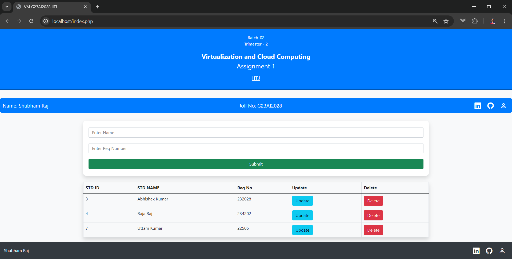

### Youtube Link : https://www.youtube.com/watch?v=E44bZC31bes
[![Watch the video]](https://www.youtube.com/watch?v=E44bZC31bes)

### Screenshot of Application | VM | IP | DATABASE

# Submit function on VM

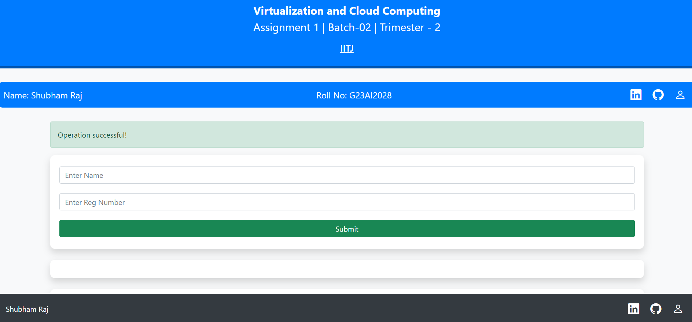

# Delete function on VM

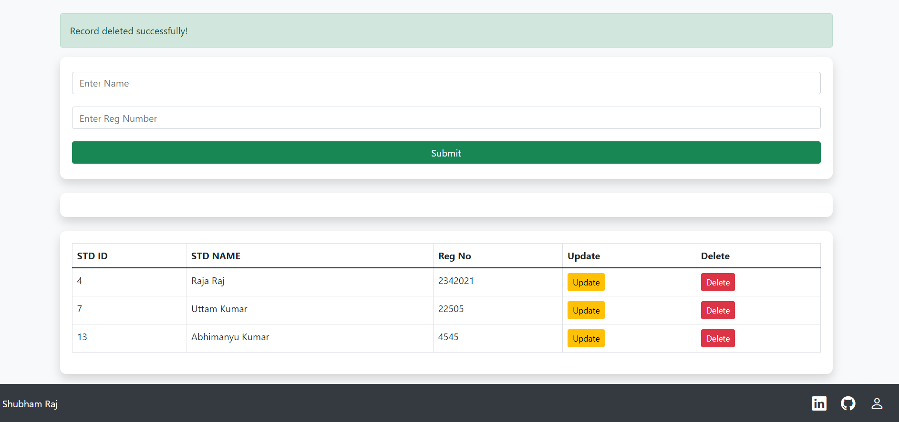

# Update function on VM

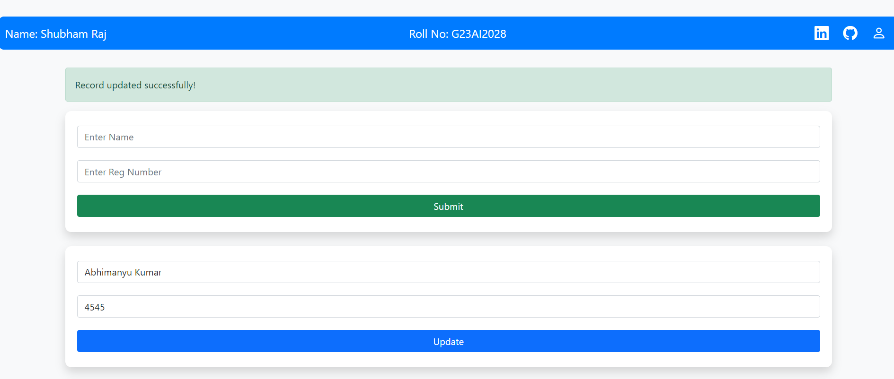

# IP of VM1

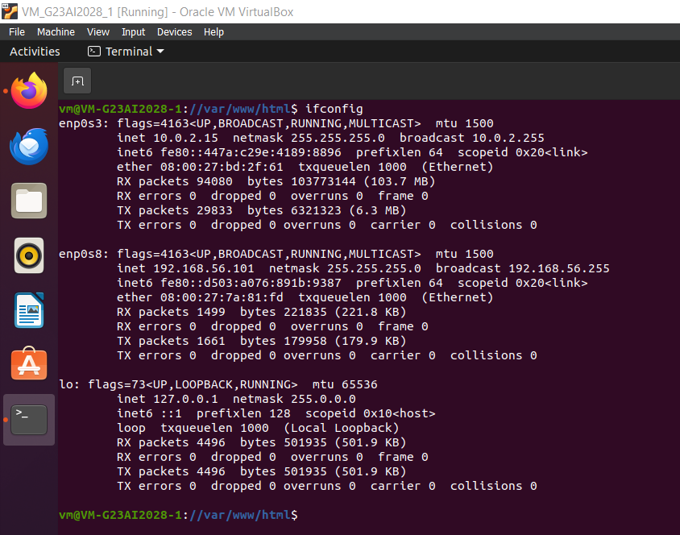

# IP of VM2

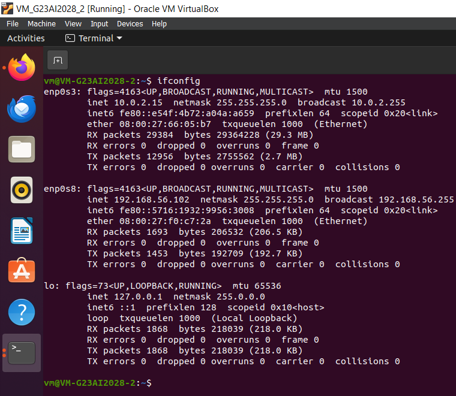

# IP of VM3

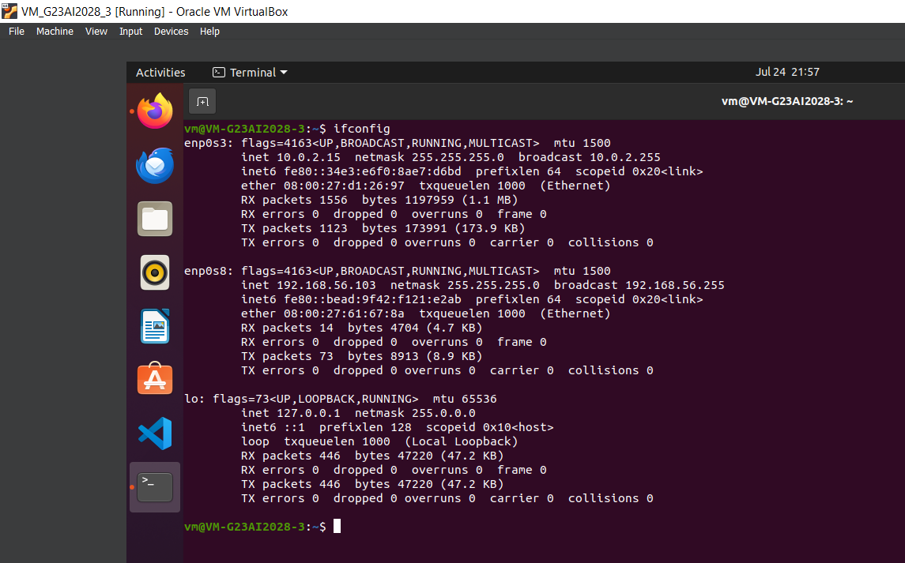

# Status of APACHE2 on VM1

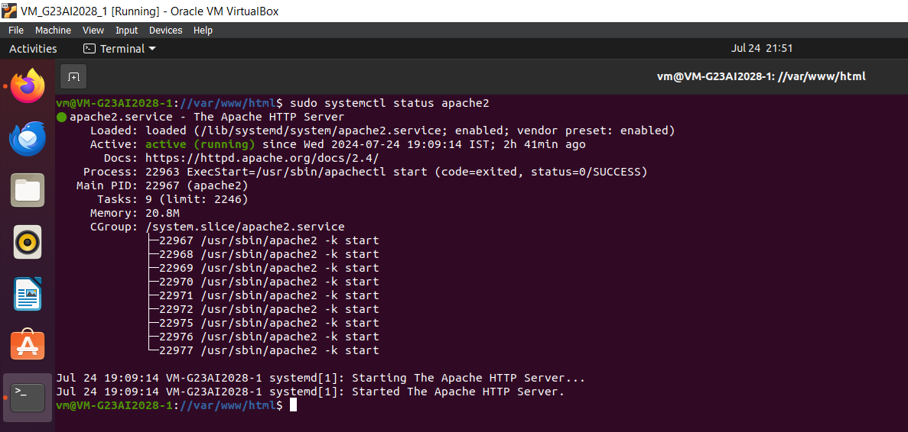

# Status of MySql on VM2

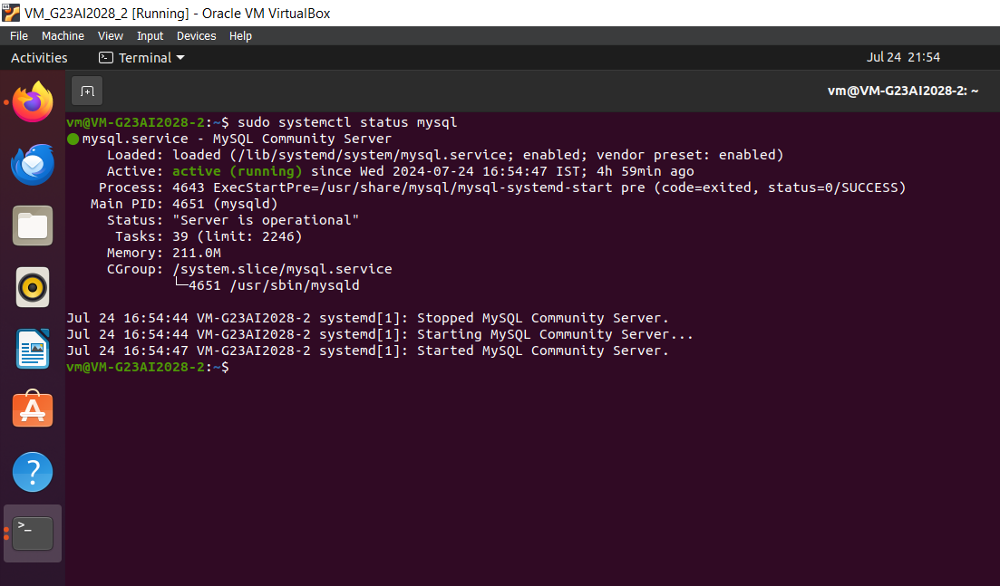

# Accessing VM1 Server from VM3

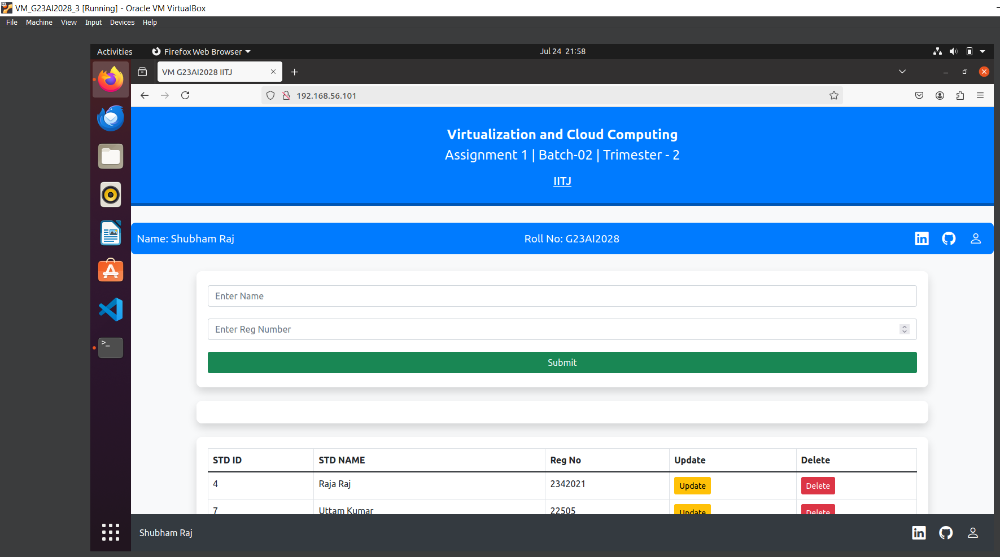

# Database from VM2 Part1

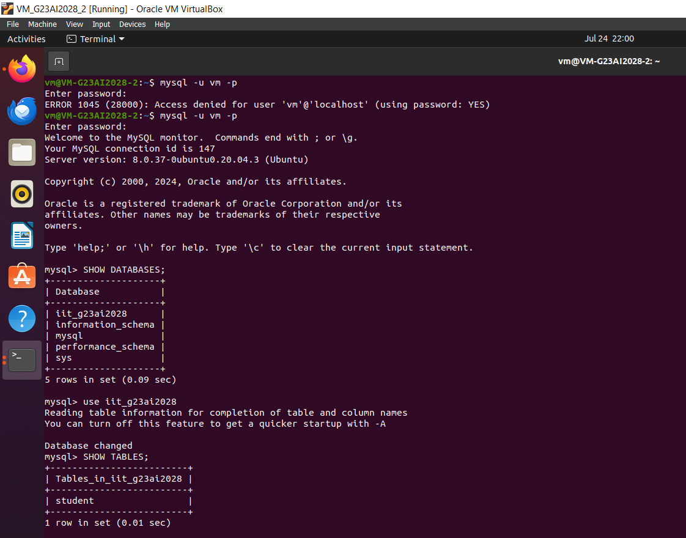

# Database from VM2 Part2

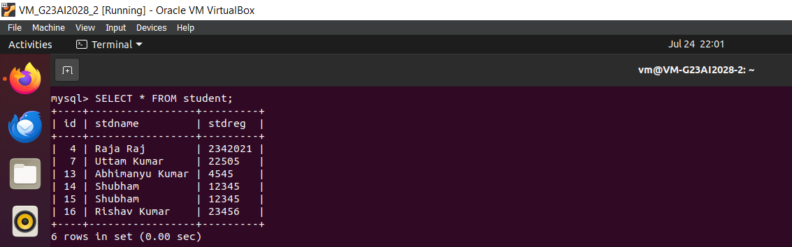


## Built With

- apache2
- mysql
- php
- Github

## Getting Started

To get started with the app, cd to the directory where you would like the repo to live by typing on your terminal:

```
$ cd <directory>
```

# Clone the repo typing for reference only:

```
$ git clone git@github.com:shubham14p3/vm-g23ai2028-php.git
```

## Install three VM with Ubuntu 20.x or any version available:

- Step 1 : VM1 - Installing PHP and Apache2

```
$ sudo apt install
$ sudo apt update
$ sudo apt install apache2
$ sudo ufw allow in "Apache Full"
$ sudo ufw status
```
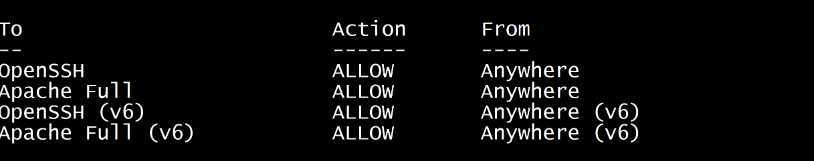

- if it is not showing up dp the followings :
```
$ sudo ufw enable
$ sudo ufw allow 'Apache Full'
$ sudo ufw allow 'OpenSSH'
$ sudo systemctl enable apache2
$ sudo systemctl enable ssh
$ sudo ufw status verbose
```

Continue if you see the above as it is 

```
$ sudo ufw enable
$ sudo apt install php libapache2-mod-php php-mysql
$ sudo nano /var/www/html/index.php
$ sudo systemctl start apache2
$ sudo systemctl status apache2
$ ifconfig
```

- Step 2 : VM2 - Installing mysql-server

```
$ sudo apt install
$ sudo apt update
$ sudo apt install mysql-server
$ sudo mysql_secure_installation
$ mysql -u vm -p
$ mysql> CREATE DATABASE iit_g23ai2028; USE iit_g23ai2028;
$ mysql> CREATE TABLE student ( id int(10) NOT NULL, stdname text NOT NULL, stdreg text NOT NULL ) ENGINE=InnoDB DEFAULT CHARSET=utf8mb4;
$ mysql> INSERT INTO student (id, stdname, stdreg) VALUES (1, 'Shubham Raj', '22'), (2, 'Abhimanu Kumar', '55'), (3, 'Rishav Raj Kumar', '21');
$ mysql> ALTER TABLE student ADD PRIMARY KEY (id);
$ mysql> ALTER TABLE student MODIFY id int(10) NOT NULL AUTO_INCREMENT, AUTO_INCREMENT=8;
$ mysql> EXIT
$ sudo systemctl start mysql
$ sudo systemctl status mysql
$ ifconfig
```

- Note: You might need to create a user for db to acces for me is is 'vm' you need to do the following command  
```
$ sudo mysql -u root -p
$ mysql> SELECT host, user FROM mysql.user;
$ mysql> CREATE USER 'vm'@'localhost' IDENTIFIED BY 'your_password';
$ mysql> GRANT ALL PRIVILEGES ON *.* TO 'vm'@'localhost' WITH GRANT OPTION;
$ mysql> FLUSH PRIVILEGES;
```

Check if you User has access by giving the following command :
```
$ mysql> SELECT host, user FROM mysql.user;
```

If not We need to Bind the address 

```
sudo nano /etc/mysql/mysql.conf.d/mysqld.cnf
$sudo ufw allow 3306
```
it should looke something like this :
```
. . .
lc-messages-dir = /usr/share/mysql
skip-external-locking
#
# Instead of skip-networking the default is now to listen only on
# localhost which is more compatible and is not less secure.
bind-address            = 0.0.0.0
. . .
```


- Step 3 : VM3 - Accessing VM1 & VM2

```
$ ping <vm1 IP>
$ ping <vm2 IP>
```
if both IP give response we can open any Web browser and open the VM1 (Server Hosted IP)

```
Open below link in your browser.
Local:   http://192.168.56.101/
```
- Note: The above ip can change depending on system config, so do check the config IP.

## Extra Knowledge: Setting up Dummy Data in Database

- a : Create new file Dockerfile and place the below code

```
<!-- Creates and selects the iit_g23ai2028 database. -->
CREATE DATABASE iit_g23ai2028; USE iit_g23ai2028;

<!-- Create Table student -->
CREATE TABLE student ( id int(10) NOT NULL, stdname text NOT NULL, stdreg text NOT NULL ) ENGINE=InnoDB DEFAULT CHARSET=utf8mb4;

<!-- Defines the student table with id, stdname, and stdreg columns. -->
<!-- Insert DummyData -->
INSERT INTO student (id, stdname, stdreg) VALUES (1, 'Shubham Raj', '22'), (2, 'Abhimanu Kumar', '55'), (3, 'Rishav Raj Kumar', '21');

<!-- Add Primary Key -->
ALTER TABLE student ADD PRIMARY KEY (id);

<!-- Sets id to auto-increment starting from 8. -->
ALTER TABLE student MODIFY id int(10) NOT NULL AUTO_INCREMENT, AUTO_INCREMENT=8;'
```
- b: To View the above table content run the folloing command:

```
$ mysql -u vm -p
$ SHOW DATABASES;
$ USE iit_g23ai2028;
$ SHOW students
$ SELECT * FROM students

```
- Note: The above commands can change depending on username, db name and different versions, so do keep in mind.

- C: To connect SQL between two vms:

```
On VM2
$mysql -u root -p
$sql> GRANT ALL PRIVILEGES ON *.* TO 'username'@'%' IDENTIFIED BY 'password' WITH GRANT OPTION;
$sql> FLUSH PRIVILEGES;

On VM2
$sudo ufw allow 3306
$sudo ufw reload

```
- D: To test the Sql form VM2 (Or MySql Host)

```
$ mysql -u user -h database_server_ip -p
```

# Connecting to DB

```
 $conn = mysqli_connect('192.168.56.102', 'vm', '123456789', 'iit_g23ai2028');
```
- Ip '192.168.56.102' is the VM2 Ip address where Mysql is Hosted. 
- User name for the Database is 'vm'. 
- Password for DB is '123456789'. 
- Database name is as 'iit_g23ai2028'. 

### Prerequisites (Minimum)

- Oracle VM VirtualBox (or any Virtual Machine)
- SQL Basic Commands
- Linux Basix Commands
- PHP Understanding
- Apache2 config understanding

### Refereces

- [Oracle VM VirtualBox](https://www.virtualbox.org/)
- [Github](https://github.com)
- [Loom](https://www.loom.com/)

## Authors

👤 **Shubham Raj**

- Github: [@ShubhamRaj](https://github.com/shubham14p3)
- Linkedin: [Shubham14p3](https://www.linkedin.com/in/shubham14p3/)
- Roll No - G23AI2028


## 🤝 Contributing

Contributions, issues and feature requests are welcome!

Feel free to check the [issues page](https://github.com/shubham14p3/vm-g23ai2028-php/issues).

## Show your support

Give a ⭐️ if you like this project!

## Acknowledgments

- Project requested by [IITJ](https://www.iitj.ac.in/).

<!-- MARKDOWN LINKS & IMAGES -->

[contributors-shield]: https://img.shields.io/github/contributors/shubham14p3/members-only.svg?style=flat-square
[contributors-url]: https://github.com/shubham14p3/vm-g23ai2028-php/graphs/contributors
[forks-shield]: https://img.shields.io/github/forks/shubham14p3/members-only.svg?style=flat-square
[forks-url]: https://github.com/shubham14p3/vm-g23ai2028-php/network/members
[stars-shield]: https://img.shields.io/github/stars/shubham14p3/members-only.svg?style=flat-square
[stars-url]: https://github.com/shubham14p3/vm-g23ai2028-php/stargazers
[issues-shield]: https://img.shields.io/github/issues/shubham14p3/members-only.svg?style=flat-square
[issues-url]: https://github.com/shubham14p3/vm-g23ai2028-php/issues
